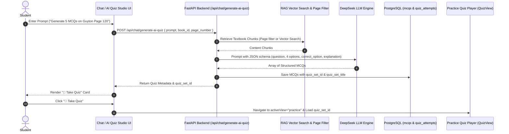

# Technical Design Specification: AI Quiz Generation System

**Date:** 2026-07-21  
**Status:** Approved  
**Target Module:** Backend API (`app/main.py`), Frontend Chat (`ChatMessage.tsx`), Practice Center (`QuizView.tsx`), AI Quiz Studio View (`AIQuizStudioView.tsx`)

---

## 1. Overview & Objectives

The **AI Quiz Generation System** allows medical students to generate custom board-style MCQ quiz banks directly from natural language prompts in Chat or via a dedicated **AI Quiz Studio** tab. 

### Key Capabilities:
1. **Natural Language Intent Detection**: Detects prompts like *"Generate 5 MCQs on Guyton page 120"* or commands like `/quiz topic: Asthma`.
2. **Textbook RAG Context Retrieval**: Automatically retrieves textbook chunks by page number filter or vector cosine similarity search.
3. **Structured DeepSeek MCQ Generation**: Generates 4-option clinical MCQs with correct answer keys and detailed medical reasoning/citations in strict JSON format.
4. **Grouped Quiz Sets & History**: Stores generated MCQs under a discrete `quiz_set_id` and `quiz_set_title` in PostgreSQL for persistent history tracking.
5. **Seamless "Take Quiz" Cards**: Renders interactive "🎯 Take Quiz" action cards in Chat and AI Quiz Studio, switching seamlessly to `QuizView` for practice.

---

## 2. System Architecture & Data Flow



---

## 3. Database Schema Updates (`schema.sql` & `models.py`)

Add `quiz_set_id` and `quiz_set_title` columns to the `mcqs` table to support discrete quiz batch grouping:

```sql
-- Migration snippet for mcqs table
ALTER TABLE mcqs ADD COLUMN IF NOT EXISTS quiz_set_id TEXT;
ALTER TABLE mcqs ADD COLUMN IF NOT EXISTS quiz_set_title TEXT;

CREATE INDEX IF NOT EXISTS idx_mcqs_quiz_set_id ON mcqs (quiz_set_id);
```

### Updated `MCQ` SQLAlchemy Model (`backend/app/models.py`)
```python
class MCQ(Base):
    __tablename__ = "mcqs"

    id: Mapped[int] = mapped_column(primary_key=True)
    book_id: Mapped[int | None] = mapped_column(ForeignKey("books.id"), default=None)
    quiz_set_id: Mapped[str | None] = mapped_column(Text, default=None)
    quiz_set_title: Mapped[str | None] = mapped_column(Text, default=None)
    question_text: Mapped[str] = mapped_column(Text)
    options: Mapped[dict] = mapped_column(JSONB)
    correct_option: Mapped[str] = mapped_column(Text)
    topic: Mapped[str | None] = mapped_column(Text, default=None)
    main_category: Mapped[str | None] = mapped_column(Text, default="AI Custom Quiz")
    sub_category: Mapped[str | None] = mapped_column(Text, default=None)
    explanation_markdown: Mapped[str | None] = mapped_column(Text, default=None)
    status: Mapped[str] = mapped_column(Text, server_default="ready")
```

---

## 4. API Endpoint Specifications

### 1. `POST /api/chat/generate-ai-quiz`
* **Request Payload**:
  ```json
  {
    "prompt": "Generate 5 questions on Renal Tubular Transport from Guyton Page 120",
    "book_id": 14,
    "page_number": 120,
    "count": 5
  }
  ```
* **Logic**:
  1. Parse prompt for page numbers, question counts, or topics if not explicitly provided. Default to 5 questions.
  2. If `page_number` is present, fetch chunks matching `book_id` and `page_number`. Otherwise, perform vector search on `prompt`.
  3. Call DeepSeek LLM with system prompt enforcing strict JSON output:
     ```json
     {
       "quiz_title": "Renal Tubular Transport",
       "questions": [
         {
           "question_text": "...",
           "options": {"A": "...", "B": "...", "C": "...", "D": "..."},
           "correct_option": "B",
           "explanation": "..."
         }
       ]
     }
     ```
  4. Generate a unique `quiz_set_id` (e.g. `quiz_set_8f9a2b`).
  5. Bulk insert generated MCQs into database with `quiz_set_id` and `quiz_set_title`.
* **Response**:
  ```json
  {
    "quiz_set_id": "quiz_set_8f9a2b",
    "quiz_set_title": "Renal Tubular Transport",
    "total_questions": 5,
    "mcqs": [...]
  }
  ```

### 2. `GET /api/chat/ai-quizzes`
* **Response**: List of distinct generated quiz sets for History tab:
  ```json
  [
    {
      "quiz_set_id": "quiz_set_8f9a2b",
      "quiz_set_title": "Renal Tubular Transport",
      "question_count": 5,
      "created_at": "2026-07-21T14:35:00Z"
    }
  ]
  ```

### 3. `DELETE /api/chat/ai-quizzes/{quiz_set_id}`
* Deletes all MCQs associated with the specified `quiz_set_id`.

---

## 5. Frontend UI Component Breakdown & Enhancements

1. **AI Quiz Studio View (`AIQuizStudioView.tsx`)**:
   - **Freeform Prompt Bar**: Conversational text input with interactive suggestion chips (*"⚡ 5 MCQs from Guyton page 120"*, *"🫀 Cardiovascular Rapid Recall"*, *"🫁 Pulmonary Physiology Board Exam"*).
   - **Quiz History Panel**: Fetches metadata via `GET /api/chat/ai-quizzes` and renders cards showing title, question count, creation timestamp, and 1-click actions:
     - **"🎯 Take Quiz"** (opens interactive player)
     - **"🗑️ Delete Set"** (deletes quiz set)

2. **Chat Card Component (`ChatMessage.tsx`)**:
   - Intercepts quiz generation responses and renders an interactive status card with a **"🎯 Take Quiz"** button.

3. **Practice Center Integration (`QuizView.tsx`)**:
   - Accepts `selectedQuizSetId` prop to filter practice session questions to the generated set.
   - **Textbook Source Citation Footnotes**: Displays exact textbook references (`📖 Source: Guyton & Hall Physiology, Page 120`) alongside explanations for full clinical transparency.

---

## 6. Error Handling & Edge Cases

* **No Textbook Context Found**: Returns a clear 404 message if the specified page number or topic has no indexed chunks.
* **LLM JSON Malformed**: Automatically retries generation up to 2 times with a JSON repair prompt.
* **Empty Prompt Guard**: Rejects blank prompts with a validation message.
